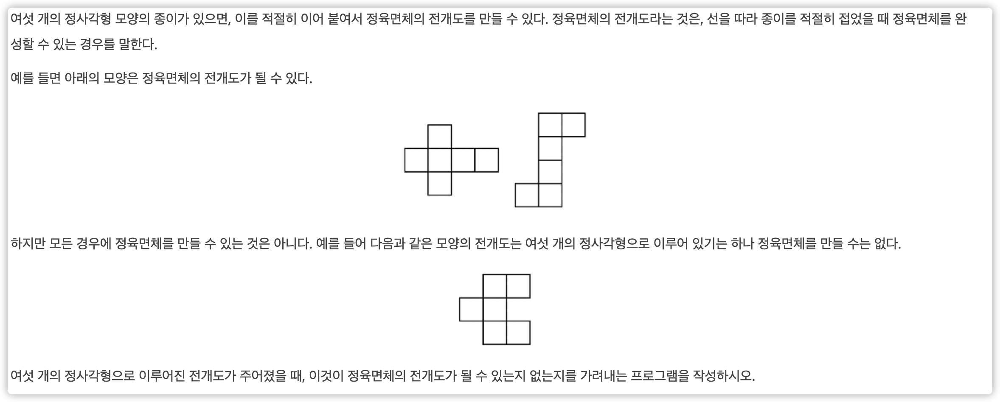
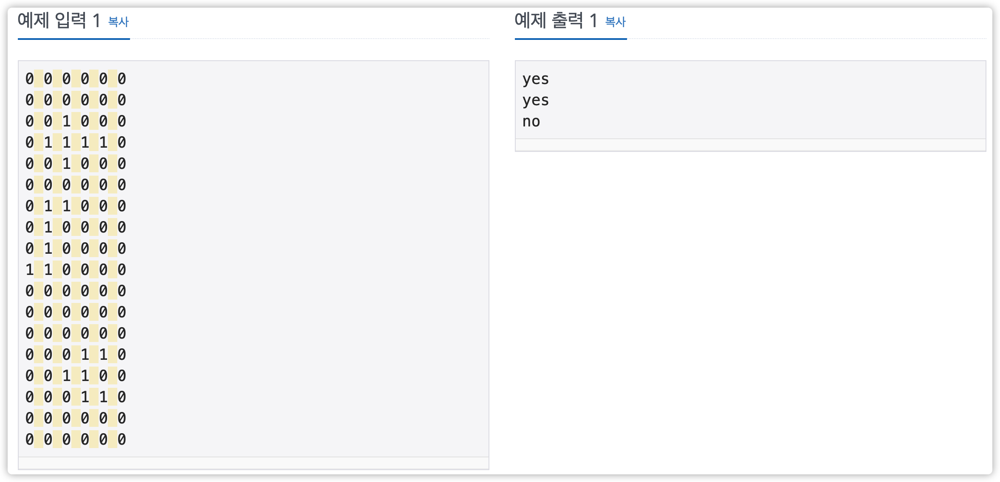

# 정육면체 전개도

## 문제

https://www.acmicpc.net/problem/1917

## 문제 본문



## 입출력

세 개의 입력 데이터가 주어지며, 각각의 입력 데이터는 여섯 개의 줄로 이루어져 있다. 각 데이터는 여섯 개의 줄에 걸쳐 여섯 개의 숫자가 빈 칸을 사이에 두고 주어진다. 숫자는 0 또는 1로 이루어지며, 36개의 숫자 중 1은 정확히 6개가 있다. 0은 공백을 나타내며 1은 정사각형을 나타낸다. (즉 전체의 그림이 전개도를 나타낸다고 보면 된다.) 정사각형들이 서로 떨어져 있는 경우는 없다.

세 개의 줄에 걸쳐, 입력된 순서대로 전개도가 정육면체의 전개도이면 yes를, 아니면 no를 출력한다.



입력

0 0 0 0 0 0

0 0 0 0 0 0

0 0 1 0 0 0

0 1 1 1 1 0

0 0 1 0 0 0

0 0 0 0 0 0

0 1 1 0 0 0

0 1 0 0 0 0

0 1 0 0 0 0

1 1 0 0 0 0

0 0 0 0 0 0

0 0 0 0 0 0

0 0 0 0 0 0

0 0 0 1 1 0

0 0 1 1 0 0

0 0 0 1 1 0

0 0 0 0 0 0

0 0 0 0 0 0

출력

yes

yes

no

## 접근방법:


###  첫 번째

```cpp
#include <string.h>
#include <algorithm>
#include <cmath>
#include <iostream>
#include <string>
#include <vector>

#define OFFSET 10

using namespace std;

// 시계방향 90도 회전
void clockwise90(vector<vector<int>>& map, vector<vector<int>>& temp) {
    int size = 6 + 2 * OFFSET;
    for (int i = 0; i < size; i++) {
        for (int j = 0; j < size; j++) {
            map[j][size - i - 1] = temp[i][j];
        }
    }

    for (int i = 0; i < size; i++) {
        for (int j = 0; j < size; j++) {
            temp[i][j] = map[i][j];
        }
    }
}

void flipHorizontal(vector<vector<int>>& map, vector<vector<int>>& temp) {
    int size = 6 + 2 * OFFSET;
    for (int i = 0; i < size; i++) {
        for (int j = 0; j < size; j++) {
            map[size - i - 1][j] = temp[i][j];
        }
    }

    for (int i = 0; i < size; i++) {
        for (int j = 0; j < size; j++) {
            temp[i][j] = map[i][j];
        }
    }
}

void flipVertical(vector<vector<int>>& map, vector<vector<int>>& temp) {
    int size = 6 + 2 * OFFSET;
    for (int i = 0; i < size; i++) {
        for (int j = 0; j < size; j++) {
            map[i][size - j - 1] = temp[i][j];
        }
    }

    for (int i = 0; i < size; i++) {
        for (int j = 0; j < size; j++) {
            temp[i][j] = map[i][j];
        }
    }
}

bool solve2(vector<vector<int>>& map) {
    bool hor4 = false;
    bool hor3 = false;
    bool ver4 = false;
    bool ver3 = false;

    int cx, cy = 0;

    for (int y = OFFSET; y < 6 + OFFSET; y++) {
        if (hor4)
            break;
        for (int x = OFFSET; x <= 3 + OFFSET; x++) {
            if (map[y][x] + map[y][x + 1] + map[y][x + 2] + map[y][x + 3] ==
                4) {
                hor4 = true;
                cx = x;
                cy = y;
                break;
            }
        }
    }

    if (hor4) {
        if (map[cy - 1][cx] + map[cy - 1][cx + 1] + map[cy - 1][cx + 2] +
                    map[cy - 1][cx + 3] ==
                1 &&
            map[cy + 1][cx] + map[cy + 1][cx + 1] + map[cy + 1][cx + 2] +
                    map[cy + 1][cx + 3] ==
                1) {
            return true;
        }
    }

    for (int y = OFFSET; y < 6 + OFFSET; y++) {
        if (hor3)
            break;
        for (int x = OFFSET; x <= 4 + OFFSET; x++) {
            if (map[y][x] + map[y][x + 1] + map[y][x + 2] == 3) {
                hor3 = true;
                cx = x;
                cy = y;
                break;
            }
        }
    }

    if (hor3) {
        if (map[cy + 1][cx] + map[cy + 1][cx + 1] + map[cy + 1][cx + 2] == 1) {
            if (map[cy - 1][cx] && map[cy - 1][cx - 1]) {
                return true;
            }
            if (map[cy - 1][cx + 2] && map[cy - 1][cx + 3]) {
                return true;
            }
        }
        if (map[cy + 1][cx + 2] + map[cy + 1][cx + 3] + map[cy + 1][cx + 4] ==
            3)
            return true;
        if (map[cy + 1][cx - 2] + map[cy + 1][cx - 1] + map[cy + 1][cx] == 3)
            return true;
    }

    for (int i = OFFSET; i < 6 + OFFSET; i++) {
        for (int j = OFFSET; j < 6 + OFFSET; j++) {
            if (!map[i][j])
                continue;
            /*
            0 0 0 0 0 0
            0 1 1 0 0 0
            0 0 1 1 0 0
            0 0 0 1 1 0
            0 0 0 0 0 0
            0 0 0 0 0 0
            */
            if (map[i][j + 1] && map[i + 1][j + 1] && map[i + 1][j + 2] &&
                map[i + 2][j + 2] && map[i + 2][j + 3])
                return true;
            /*
            0 0 0 0 0 0
            0 1 0 0 0 0
            0 1 1 0 0 0
            0 0 1 1 0 0
            0 0 0 1 0 0
            0 0 0 0 0 0
            */
            if (map[i + 1][j] && map[i + 1][j + 1] && map[i + 2][j + 1] &&
                map[i + 2][j + 2] && map[i + 3][j + 2])
                return true;
        }
    }
    return false;
}

int main() {
#ifdef LOCAL
    freopen("input.txt", "r", stdin);
#endif

    int c = 3;
    for (int caseNum = 0; caseNum < c; caseNum++) {
        vector<vector<int>> map(6 + 2 * OFFSET, vector<int>(6 + 2 * OFFSET, 0));
        vector<vector<int>> temp(6 + 2 * OFFSET,
                                 vector<int>(6 + 2 * OFFSET, 0));

        // int cx, cy;
        for (int i = OFFSET; i < 6 + OFFSET; i++) {
            for (int j = OFFSET; j < 6 + OFFSET; j++) {
                cin >> map[i][j];
                temp[i][j] = map[i][j];
            }
        }

        bool bool1 = solve2(map);
        clockwise90(map, temp);

        bool bool2 = solve2(map);

        clockwise90(map, temp);

        bool bool3 = solve2(map);

        clockwise90(map, temp);
        bool bool4 = solve2(map);
        clockwise90(map, temp);

        flipHorizontal(map, temp);

        bool bool5 = solve2(map);
        flipHorizontal(map, temp);
        flipVertical(map, temp);

        bool bool6 = solve2(map);

        cout << ((bool1 || bool2 || bool3 || bool4 || bool5 || bool6) ? "yes"
                                                                      : "no")
             << endl;
    }

#ifdef LOCAL
    fclose(stdin);
#endif

    return 0;
}
```
