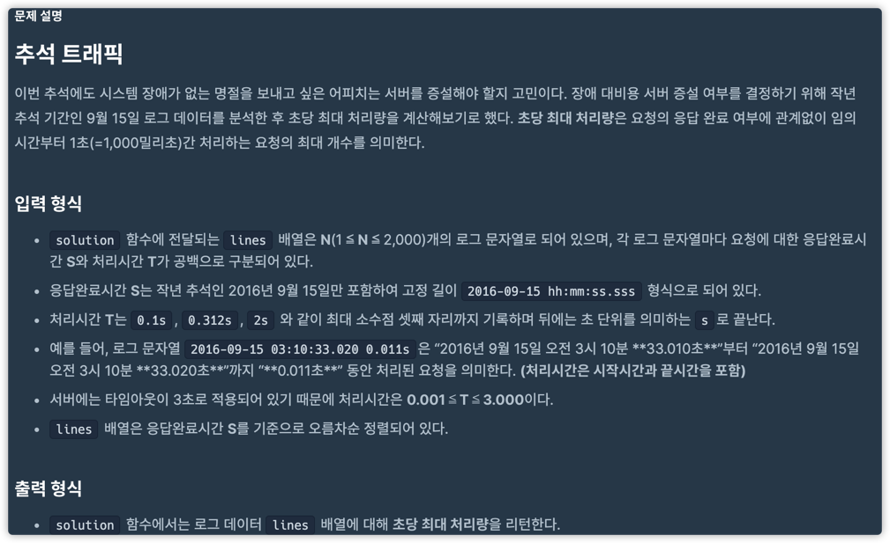
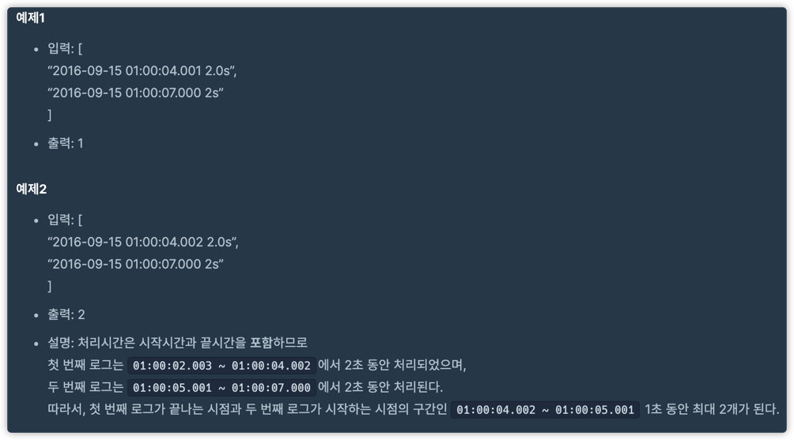
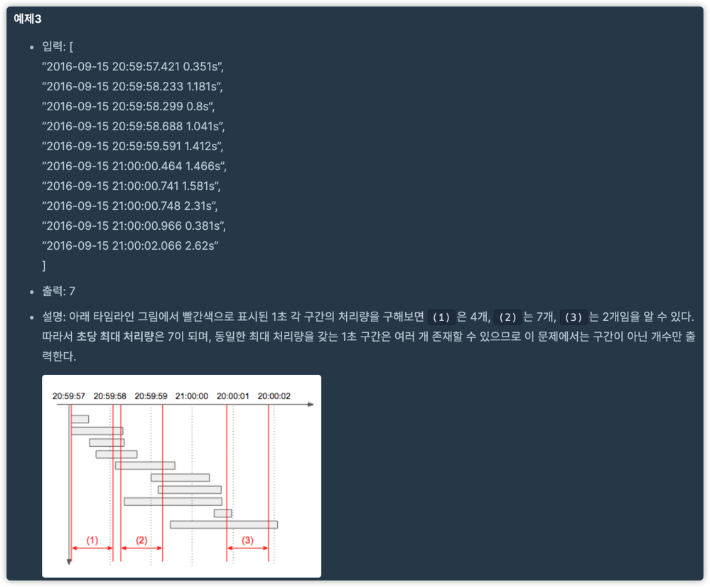

# 추석트래픽

## 문제

https://programmers.co.kr/learn/courses/30/lessons/17676

## 문제 본문



## 입출력





## 접근방법:

슬라이딩 윈도우 : https://www.acmicpc.net/problem/11003

아이디어? : https://www.acmicpc.net/problem/10799

###  첫 번째

```python
from operator import itemgetter
import re


def solution(lines):
    logs = []

    p = re.compile("[0-9,-]* (\\d{2}):(\\d{2}):(\\d{2}).(\\d{3}) (\\d)[.]?(\\d{1,3})?s")

    for log in lines:
        timeNumber = 0
        m = p.search(log)

        parsedList = list(map(int, [m.group(i + 1) for i in range(4)]))
        timeNumber += ((parsedList[0] * 60 + parsedList[1]) * 60 + parsedList[2]) * 1000 + parsedList[3]

        processTime = int(m.group(5)) * 1000 + (m.group(6) and int(m.group(6)) or 0)

        logs.append(("0start", timeNumber - processTime + 1))
        logs.append(("1end", timeNumber + 999))

    logs = sorted(logs, key=itemgetter(1, 0))

    [maxCount, count] = [0, 0]

    for [typeName, _] in logs:
        if typeName == "0start":
            count += 1
        else:
            maxCount = max(maxCount, count)
            count -= 1

    return maxCount
```
