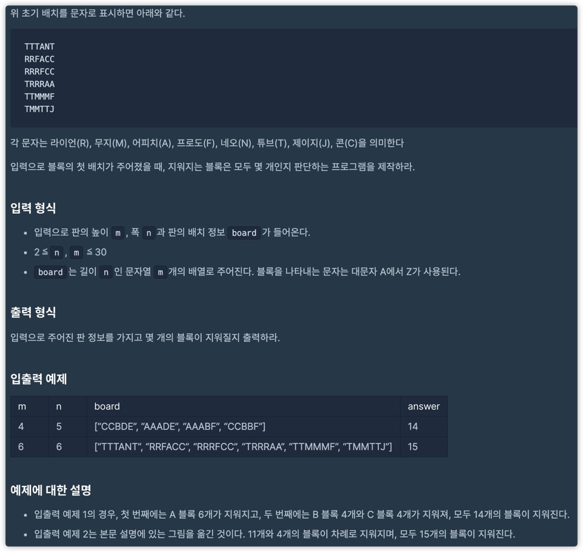

# 프렌즈4블록

## 문제

https://programmers.co.kr/learn/courses/30/lessons/17679

## 문제 본문

너무 사진이 많아서ㅎ 들어가서 보는걸 추천

## 입출력



## 접근방법:

단순 구현!

* 남아있는 블록 : 0

* 지워질 블록 : 1

* 지워진 블록 : 2

블록을 내려오게 하는 로직은 그냥 지워진 블록 기준으로 위에서 남아있는 블록 찾아서 내리면 된당

###  첫 번째

```python
def printBoard(board):
    for line in board:
        print(*list(map(lambda e: e[1] == 2 and " " or (e[1] == 1 and ('\x1b[6;30;42m' + e[0] + '\x1b[0m') or e[0]), line)), sep=" ")
    print("\n")


def solution(m, n, board):
    bm = [[[c, 0] for c in line] for line in board]

    count = 0

    while (True):
        # print("Start", count)
        # printBoard(bm)
        flag = True
        for y in range(m - 1):
            for x in range(n - 1):
                if all(map(lambda state: state != 2, [bm[y][x][1], bm[y][x + 1][1], bm[y + 1][x][1], bm[y + 1][x + 1][1]])) and [
                    bm[y][x + 1][0], bm[y + 1][x][0], bm[y + 1][x + 1][0]] == [bm[y][x][0]] * 3:
                    for i in range(4):
                        if bm[y + i // 2][x + i % 2][1] == 0:
                            count += 1
                            flag = False
                    [bm[y][x][1], bm[y][x + 1][1], bm[y + 1][x][1], bm[y + 1][x + 1][1]] = [1] * 4

        if flag:
            break
        # print("Destroy")
        # printBoard(bm)

        for y in range(m - 1, -1, -1):
            for x in range(n):
                if bm[y][x][1] != 0:
                    # print(x, y)
                    for dy in range(y - 1, -1, -1):
                        if bm[dy][x][1] == 0:
                            # print("Found ", x, dy)
                            [bm[y][x][0], bm[y][x][1]] = [bm[dy][x][0], bm[dy][x][1]]
                            bm[dy][x][1] = 2
                            break
                    if bm[y][x][1] != 0:
                        bm[y][x][1] = 2

    return count


if __name__ == "__main__":
    test = ["AABBEE","AAAEEE","VAAEEV","AABBEE","AACCEE","VVCCEE"]
    print(solution(6, 6, test))
```
